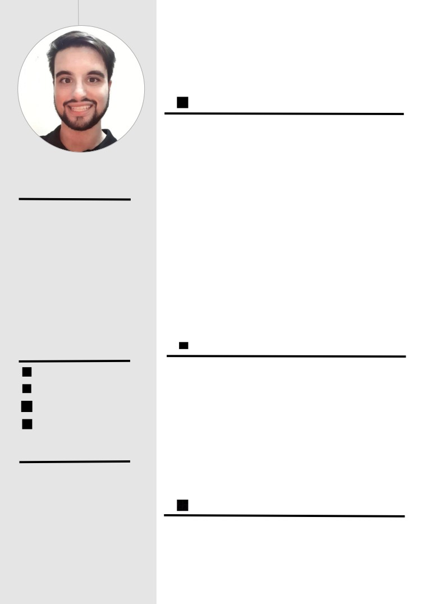

<html>
<head><meta http-equiv=Content-Type content="text/html; charset=UTF-8">
<!--
span.cls_003{font-family:Arial,serif;font-size:18.1px;color:rgb(0,0,0);font-weight:bold;font-style:normal;text-decoration: none}
div.cls_003{font-family:Arial,serif;font-size:18.1px;color:rgb(0,0,0);font-weight:bold;font-style:normal;text-decoration: none}
span.cls_005{font-family:Arial,serif;font-size:11.3px;color:rgb(118,112,112);font-weight:bold;font-style:normal;text-decoration: none}
div.cls_005{font-family:Arial,serif;font-size:11.3px;color:rgb(118,112,112);font-weight:bold;font-style:normal;text-decoration: none}
span.cls_007{font-family:Arial,serif;font-size:15.1px;color:rgb(81,81,81);font-weight:bold;font-style:normal;text-decoration: none}
div.cls_007{font-family:Arial,serif;font-size:15.1px;color:rgb(81,81,81);font-weight:bold;font-style:normal;text-decoration: none}
span.cls_008{font-family:Arial,serif;font-size:12.1px;color:rgb(81,81,81);font-weight:bold;font-style:normal;text-decoration: none}
div.cls_008{font-family:Arial,serif;font-size:12.1px;color:rgb(81,81,81);font-weight:bold;font-style:normal;text-decoration: none}
span.cls_009{font-family:Arial,serif;font-size:9.8px;color:rgb(81,81,81);font-weight:normal;font-style:normal;text-decoration: none}
div.cls_009{font-family:Arial,serif;font-size:9.8px;color:rgb(81,81,81);font-weight:normal;font-style:normal;text-decoration: none}
span.cls_010{font-family:Arial,serif;font-size:9.8px;color:rgb(81,81,81);font-weight:normal;font-style:normal;text-decoration: none}
div.cls_010{font-family:Arial,serif;font-size:9.8px;color:rgb(81,81,81);font-weight:normal;font-style:normal;text-decoration: none}
span.cls_012{font-family:Arial,serif;font-size:12.1px;color:rgb(81,81,81);font-weight:normal;font-style:normal;text-decoration: none}
div.cls_012{font-family:Arial,serif;font-size:12.1px;color:rgb(81,81,81);font-weight:normal;font-style:normal;text-decoration: none}
span.cls_013{font-family:Arial,serif;font-size:12.1px;color:rgb(81,81,81);font-weight:bold;font-style:normal;text-decoration: none}
div.cls_013{font-family:Arial,serif;font-size:12.1px;color:rgb(81,81,81);font-weight:bold;font-style:normal;text-decoration: none}
span.cls_014{font-family:Arial,serif;font-size:11.3px;color:rgb(81,81,81);font-weight:normal;font-style:normal;text-decoration: none}
div.cls_014{font-family:Arial,serif;font-size:11.3px;color:rgb(81,81,81);font-weight:normal;font-style:normal;text-decoration: none}
span.cls_015{font-family:Arial,serif;font-size:12.1px;color:rgb(81,81,81);font-weight:normal;font-style:normal;text-decoration: none}
div.cls_015{font-family:Arial,serif;font-size:12.1px;color:rgb(81,81,81);font-weight:normal;font-style:normal;text-decoration: none}
span.cls_016{font-family:Arial,serif;font-size:9.8px;color:rgb(81,81,81);font-weight:bold;font-style:normal;text-decoration: none}
div.cls_016{font-family:Arial,serif;font-size:9.8px;color:rgb(81,81,81);font-weight:bold;font-style:normal;text-decoration: none}
-->
</style>
</head>
<body>

JUAN JOSÉ GONZÁLEZ FERNÁNDEZ

FULL STACK DEVELOPER / ADMINISTRADOR DE SISTEMAS

EXPERIENCIA PROFESIONAL

DATAGRAM S.L | PROGRAMADOR JUNIOR

Julio 2019 - Agosto 2019

• Desarrollo de Aplicaciones web con JQuery, ASP.NET MVC 5 y Razor

• Acceso a datos con Microsoft SQL Server

PRISMA S.G | PROGRAMADOR EN PRÁCTICAS

SOBRE MÍ

Marzo 2019 - Junio 2019 (F.C.T)

Soy una persona jóven con

• Desarrollo de Aplicaciones con Angular 7 y Lumen 5

• Acceso a datos con MySQL

aspiraciones a crecer

• Desarrollo web con HTML5, CSS3 y Javascript

profesionalmente. Me

considero alguien

IMAGO INFORMÁTICA S.L | TÉCNICO INFORMÁTICO

perfeccionista con su labor,

que trabaja bien en equipo,

Marzo 2017 - Junio 2017 (F.C.T)

respetuoso y educado.

• Mantenimiento y reparación de equipos microinformáticos, en general

• Asistencia a particulares y empresas in situ y de forma remota

Tengo conocimientos de

• Instalación de HW/SW en PYMES

Angular e Ionic 4. He

trabajado anteriormente con

Angular, Lavarel, JQuery,

.NET e Hibernate.

FORMACIÓN

CONTACTO

618 83 31 80

C.F.G.S. DESARROLLO DE APLICACIONES

MULTIPLATAFORMA | I.E.S. LA MARISMA - Huelva

Huelva, España

Septiembre 2017 - Junio 2019

juanjogibra@gmail.com

C.F.G.S. ADMINISTRACIÓN DE SISTEMAS

 <A HREF="http://www.github.com/juanjogibra/">www.github.com/juanjogibra</A> 

INFORMÁTICOS EN RED | I.E.S. LA MARISMA - Huelva

Septiembre 2015 - Junio 2017

DATOS DE INTERÉS

BACHILLERATO DE CIENCIAS | I.E.S. LA MARISMA -

Gibraleón

•   Permiso de conducir B

Septiembre 2009 - Junio 2011

y vehículo propio

•   Flexibilidad horaria

IDIOMAS

total

Español: Nativo

•    Disponibilidad

inmediata

Inglés: Medio (Preliminary English Test Level B1 certificado por

Cambridge)

</body>
</html>
